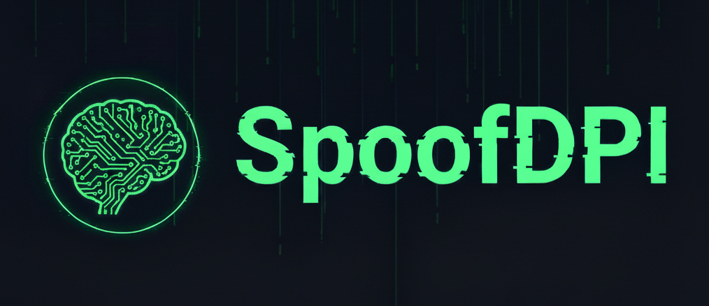

  

> [!WARNING]
> **Repository Name Changed**
> To comply with Go ecosystem standards and package naming conventions, the repository and module name have been changed from `SpoofDPI` to `spoofdpi`. If you are manually building from source or referencing the module, please update your URLs and imports accordingly.

`spoofdpi` is a simple proxy tool, mainly designed to neutralize the *Deep Packet Inspection (DPI)* techniques that power many internet censorship systems.

For more detailed information, please refer to the [Official Documentation](https://spoofdpi.xvzc.dev).

[Join our Discord channel](https://spoofdpi.xvzc.dev) for discussions (If you can 😅).

## 📦 Packaging Status

## ☕ Github Sponsors
Your sponsorship directly fuels the motivation required for continued project maintenance. If you find spoofdpi valuable, please consider supporting [@xvzc on Github](https://github.com/sponsors/xvzc).

## 💡 Inspirations
[Green Tunnel](https://github.com/SadeghHayeri/GreenTunnel) by @SadeghHayeri  
[GoodbyeDPI](https://github.com/ValdikSS/GoodbyeDPI) by @ValdikSS

## 🔗 See Also
[DPIBreak](https://github.com/dilluti0n/dpibreak) by @dilluti0n - kernel based circumvention tool for Linux and Windows
